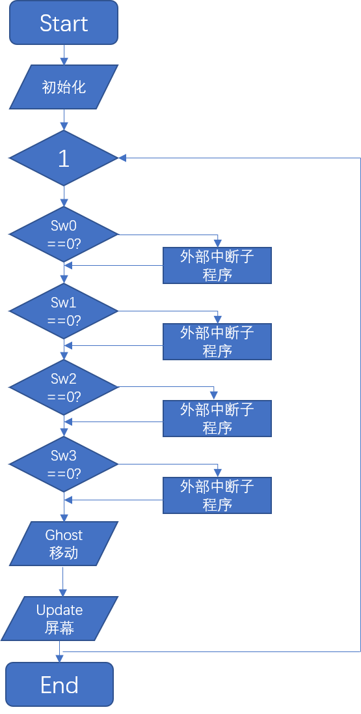
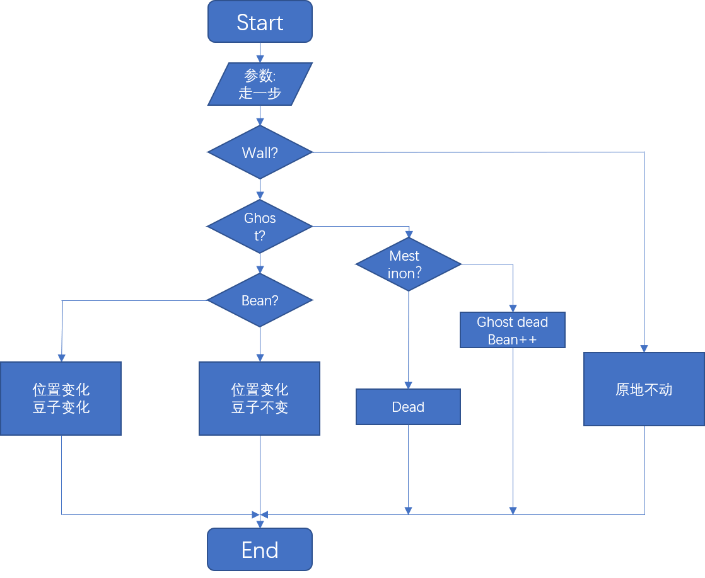

# <div style="text-align:center">综合实验:单片机吃豆人(Pacman)游戏</div>
## <div style="text-align:center">PB19061294 武汉</div>
## 一、设计构思
1. 内容介绍
- 本文要实现在STM32F407ZG上实现经典吃豆人(Pacman)的实验目标。
- 吃豆人的游戏规则介绍如下:
- - 吃豆人可以沿着线路上下左右移动，但是不能穿墙。吃豆人要尽可能多的吃掉豆子，吃掉豆子会获得一定的分数。
- - 吃豆人会被四个鬼魂(ghost)追击，刚开始鬼魂都在中间的鬼屋，游戏开始时开始行动。如果吃豆人被鬼魂发现并吃掉，游戏结束。
- - 和吃豆人一样，鬼魂也不能穿墙，并且在非拐弯时只能直行，它们可以互相穿过对方身体。
- - 场景中分布着数枚"大力丸"，在大力丸的药效作用内，鬼魂四散奔逃，吃豆人可以追击吃掉鬼魂并且获得一定的分数。
- 具体在单片机上实现时，我使用LCD作为输出，使用SW0-4四个按键分别控制吃豆人的上下左右移动。
2. 流程分析
- 以下流程图中判断语句均为下行为N，分支为Y，故省略。
- 顶层逻辑</br>



- 外部中断子程序 



## 二、模块设置
1. SW-GPIO对应如下所示, 采用上拉输入

   | 硬件 | 引脚 |
   | :--: | :--: |
   | SW0  | PE0  |
   | SW1  | PE1  |
   | SW2  | PE2  |
   | SW3  | PE3  |

2. LCD-GPIO对应如下所示, 采用上拉输入

   | 硬件 | 引脚 |
   | :--: | :--: |
   | SID  | PF15 |
   | SCLK | PF14 |
   |  CS  | PG1  |

## 三、内部逻辑
1. 显示逻辑

- 在显示方面，由于LCD屏幕只有64*128个像素大小，因此地图、吃豆人等只能以bits为单位。又12864不支持局部刷新，因此只能采用全刷新、自定义字型RAM的方式，每次传入一整个数组。因此程序中采用三图层方式，地图为第一图层，豆子为第二图层，人物、鬼魂、大力丸为第三图层。并且封装checkbit、setbit、changebit等函数方便按像素操作。由于LCD刷新过慢，因此采用多次处理一次显示的方式，每过若干周期传入三个图层按位与之后的数组刷新一次屏幕。

2. 控制逻辑
- 在控制方面，我使用外部中断的方式控制人物向四个方向的走动，采用轮询的方式判断是否触发，之后逻辑如上节中断子程序所示。

3. 运动逻辑
- 鬼魂的运动逻辑是游戏逻辑中最难实现的一环。每个鬼魂有三种状态:分散状态、追踪状态、惊慌状态。在前两种状态中每个鬼魂都有唯一的一个target。在规定target时鬼魂在遇到岔路口选择离target曼哈顿距离最近的岔路口。在分散状态下的target分别是地图的四个边角，在追踪状态下，四个鬼魂的target分别是:吃豆人本身、吃豆人前面8格、和第一个鬼魂关于吃豆人中心对称的格子、距离<32格子会放弃追踪，>32格子追踪吃豆人本身。在惊慌状态下鬼魂每遇到一个岔路口就会随机选择一个逃跑。
## 四、核心源码
由于核心源码比较多，这里只贴出实现pacman以及和单片机交互的部分。
```c
//设置bit位
void changebit(__UINT8_TYPE__ x, __UINT8_TYPE__ y, __UINT8_TYPE__ *list)
{
    list[16 * y + x / 8] ^= (1 << (7 - x % 8));
}
void setbit(__UINT8_TYPE__ x, __UINT8_TYPE__ y, __UINT8_TYPE__ *list, __UINT8_TYPE__ what)
{
    if (what)
        list[16 * y + x / 8] |= (1 << (7 - x % 8));
    else
        list[16 * y + x / 8] &= ~(1 << (7 - x % 8));
}
__UINT8_TYPE__ checkbit(__UINT8_TYPE__ x, __UINT8_TYPE__ y, __UINT8_TYPE__ *list)
{
    return ((list[16 * y + x / 8] & (1 << (7 - x % 8))) == 0 ? 0 : 1);
}
```
```c
//更新位置数组
void update(void)
{
    static __UINT8_TYPE__ ii = 0;
    for (int i = 0; i < 1024; i++)
    {
        ShowData[i] = douData[i] | MapData[i];
    }
    for (__UINT8_TYPE__ j = 0; j < 5; j++)
    {
        if (dead[j] == 1)
            continue;
        else
        {
            ii = 1 - ii;
            setbit(x[j], y[j], ShowData, 1);
            setbit(x[j] + 1, y[j] + 1, ShowData, 1);
            setbit(x[j] - 1, y[j] - 1, ShowData, 1);
            setbit(x[j] + 1, y[j] - 1, ShowData, 1);
            setbit(x[j] - 1, y[j] + 1, ShowData, 1);
            if (dalitime == 0 || (dalitime < 50 && ii == 0) || j == 0)
            {
                setbit(x[j], y[j] + 1, ShowData, 1);
                setbit(x[j] - 1, y[j], ShowData, 1);
                setbit(x[j] + 1, y[j], ShowData, 1);
                setbit(x[j], y[j] - 1, ShowData, 1);
            }
        }
    }
    for (__UINT8_TYPE__ i = 0; i < 4; i++)
    {
        if (daliwan[i][3] == 0)
            continue;
        setbit(daliwan[i][0], daliwan[i][1], ShowData, 1);
        if (daliwan[i][2])
        {
            setbit(daliwan[i][0] - 1, daliwan[i][1], ShowData, 1);
            setbit(daliwan[i][0] + 1, daliwan[i][1], ShowData, 1);
        }
        else
        {
            setbit(daliwan[i][0], daliwan[i][1] - 1, ShowData, 1);
            setbit(daliwan[i][0], daliwan[i][1] + 1, ShowData, 1);
        }
    }
}
```
```c
//判断某位置是什么，0为路、1为鬼魂、2为豆子、3为墙、4为大力丸
__UINT8_TYPE__ whats(__UINT8_TYPE__ m, __UINT8_TYPE__ n)
{
    for (__UINT8_TYPE__ i = 1; i <= 4; i++)
    {
        if (m == x[i] && n == y[i] && !dead[i])
            return 1;
    }
    if (checkbit(m, n, douData))
        return 2;
    if (checkbit(m, n, MapData))
        return 3;
    for (__UINT8_TYPE__ i = 0; i < 4; i++)
    {
        if (m == daliwan[i][0] && n == daliwan[i][1] && daliwan[i][3] != 0)
        {
            return 4;
        }
    }
    return 0;
}
```

```c
//人的行走函数
__UINT8_TYPE__ zoulu(__UINT8_TYPE__ keydown, __UINT8_TYPE__ newdirection)
{ //0up 1down 2left 3 right
    if (keydown)
    {
        __UINT8_TYPE__ newx = x[0] + deltax(newdirection), newy = y[0] + deltay(newdirection);

        if (!zq(newx, newy))
        {
            __UINT8_TYPE__ what = whats(newx, newy);

            switch (what)
            {
            case 4:
                for (__UINT8_TYPE__ i = 0; i < 4; i++)
                {
                    if (daliwan[i][0] == newx && daliwan[i][1] == newy)
                    {
                        daliwan[i][3] = 0;
                        break;
                    }
                }
                for (__UINT8_TYPE__ i = 1; i <= 4; i++)
                {
                    direction[i] = fanxiang(direction[i]);
                }

                x[0] = newx;
                y[0] = newy;
                direction[0] = newdirection;
                dalitime = 500;
                break;
            case 2:
                setbit(newx, newy, douData, 0);
                score++;
                //char str[30];
                //sprintf(str, "title score=%d", score);
                //system(str);
                x[0] = newx;
                y[0] = newy;
                direction[0] = newdirection;
                break;
            case 0:
                x[0] = newx;
                y[0] = newy;
                direction[0] = newdirection;
                break;
            case 1:
                if (dalitime > 0)
                {
                    for (__UINT8_TYPE__ i = 1; i <= 4; i++)
                    {
                        if (x[i] == newx && y[i] == newy)
                        {
                            dead[i] = 1;
                            score += 20;
                            break;
                        }
                    }
                }
                else
                {
									  char str[30];
										sprintf(str, "Your score=%d", score);
                    lcd_wstr(2,1,"You died.");
									  lcd_wstr(3,1,str);
										return 1;
                    //system("pause");
                    //exit(0);
                }
                break;
            }
        }
    }
		return 0;
}
```
```c
//鬼魂的行走函数
__UINT8_TYPE__ autoi()
{

    int targetx[5], targety[5];
    if (fensantime > 0)
    {
        targetx[1] = 127;
        targety[1] = 0;
        targetx[2] = 127;
        targety[2] = 0;
        targetx[3] = 0;
        targety[3] = 0;
        targetx[4] = 0;
        targety[4] = 0;
    }
    else
    {
        targetx[1] = x[0];
        targety[1] = y[0];
        targetx[2] = 2 * x[0] - x[1];
        targety[2] = 2 * y[0] - y[1];
        targetx[3] = x[0] + 8 * deltax(direction[0]);
        targety[3] = y[0] + 8 * deltay(direction[0]);
        if (abs(x[4] - x[0]) + abs(y[4] - y[0]) > 32)
        {
            targetx[4] = x[0];
            targety[4] = y[0];
        }
        else
        {
            targetx[4] = 0;
            targety[4] = 0;
        }
    }
    for (__UINT8_TYPE__ i = 1; i <= 4; i++)
    {
        if (dead[i])
            continue;
        int bestdirection;
        int bestdist = dalitime > 0 ? 0 : 255;
        for (__UINT8_TYPE__ j = 0; j < 4; j++)
        {
            int newx = x[i] + deltax(j);
            int newy = y[i] + deltay(j);
            if (zq(newx, newy))
                continue;

            if (dalitime == 0)
            {
                int thisdist = abs(newx - targetx[i]) + abs(newy - targety[i]);
                if (fanxiang(j) == direction[i])
                    thisdist += 30;
                if (thisdist < bestdist)
                {
                    bestdist = thisdist;
                    bestdirection = j;
                }
            }
            else
            {
                int thisdist = rand();
                if (fanxiang(j) == direction[i])
                    thisdist = 1;
                if (thisdist > bestdist)
                {
                    bestdist = thisdist;
                    bestdirection = j;
                }
            }
        }
        x[i] += deltax(bestdirection);
        y[i] += deltay(bestdirection);
        direction[i] = bestdirection;
        if (x[i] == x[0] && y[i] == y[0])
        {
            if (dalitime > 0)
            {
                dead[i] = 1;
            }
            else
            {
                char str[30];
								sprintf(str, "Your score=%d", score);
                lcd_wstr(2,1,"You died.");
								lcd_wstr(3,1,str);
							return 1;
                //system("pause");
                //exit(0);
            }
        }
    }
    if (fensantime == 1)
    {
        fensantime = 0;
        for (__UINT8_TYPE__ i = 0; i < 5; i++)
        {
            setbit(61 + i, 21, MapData, 1);
        }
    }
    else if (fensantime > 0)
        fensantime--;
    if (dalitime > 0)
        dalitime--;
		return 0;
}
```
```c
//主函数
int main(void)
{ 
	delay_init(168);
  pcb_Init();
  delay_ms(20);
  lcd_clear();
  delay_ms(10);
	KEY_Init();
	int count = 0;
	while (1)
    {
			int status = 0;
        if (SW0 == 0)
        {
            status = zoulu(1, 0);
        }
        else if (SW1 == 0)
        {
            status = zoulu(1, 1);
        }
        else if (SW2 == 0)
        {
            status = zoulu(1, 2);
        }
        else if (SW3 == 0)
        {
            status = zoulu(1, 3);
        }
        autoi();
        update();
				delay_ms(20);
				if (status == 1){
				delay_ms(60000);
					break;
				}
				if (count%10==0&&status==0){
        LCD_Display_Picture(ShowData);
				delay_ms(1000);
				}
				count+=1;
    }
}
```
## 五、总结与反思
现在是2021年7月6日，这个大实验终于要接近尾声了。从最后一次统一实验的结束进入考试周开始，一直到现在；从有了这个可能看上去很离谱的点子到真正动手去做最后到做成功，一路走来，倾注了我不少的心血。

其实之前也不是没有自己写游戏的经历，但是从最底层用C语言不用任何外部库开发，这还是头一次。虽然中途也有想过做一个简单点的算了，还担心过单片机能否可以带动这么大的程序，但我还是没有放弃，中间由于各科考试断断续续被迫停了两次，考完就开始继续写这个游戏的底层逻辑。之前可以直接用的封装好的判断碰撞程序要自己实现、绘制这么微型的地图要用到像素画工具自己画、害怕单片机内存不够专门做了一些优化，修改了大段逻辑权宜性能和内存才最终敲定三个数组的方案。克服了一些看起来很头疼的困难，等到代码load到单片机上，绿色的小灯开始欢快闪烁的时候，我终于松了口气。我还是做到了呀。虽然可能由于lcd的性能原因，刷新率并没有我预料到的那么高、虽然由于STM32F407ZG的主函数循环的特性没有被我发现，导致一些退出游戏的逻辑不是很兼容，但毕竟是第一次嵌入式开发没有相关经验，这些都是没有前期做好研究的结果，在以后接触嵌入式开发的过程中我一定会更加注意。